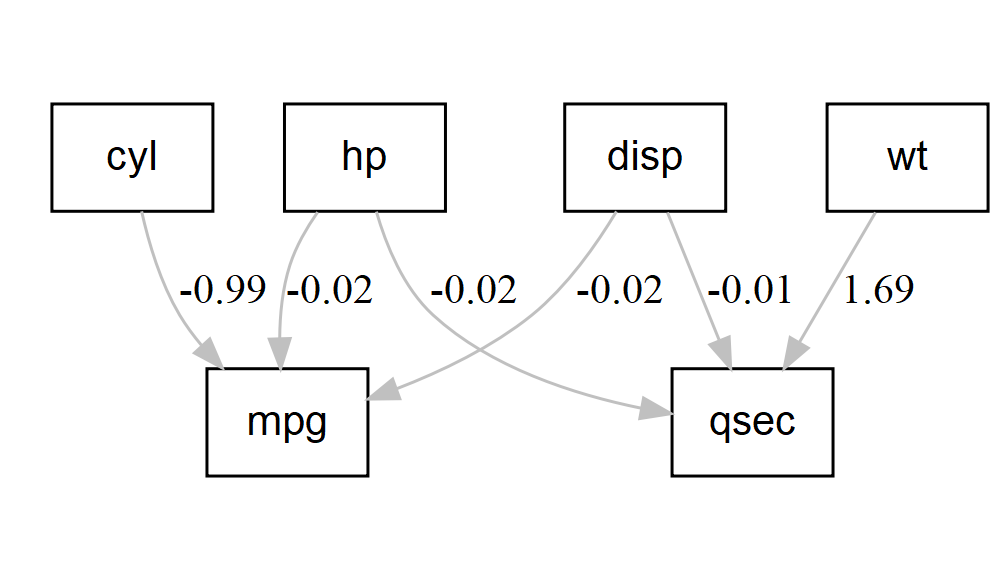

[](https://github.com/LabAsim/lavaanPlot/actions/workflows/R-CMD-check.yaml)

## Current status

The original package is not maintained for a long time, so I forked it
and add some features that I needed for my research and they were not
available. They will be documented in a new vignette.

## Background

The lavaan package is an excellent package for structural equation
models, and the DiagrammeR package is an excellent package for producing
nice looking graph diagrams. As of right now, the lavaan package has no
built in plotting functions for models, and the available options from
external packages don’t look as nice and aren’t as easy to use as
DiagrammeR, in my opinion. Of course, you can use DiagrammeR to build
path diagrams for your models, but it requires you to build the diagram
specification manually. This package exists to streamline that process,
allowing you to plot your lavaan models directly, without having to
translate them into the DOT language specification that DiagrammeR uses.

## Background

The lavaan package is an excellent package for structural equation
models, and the DiagrammeR package is an excellent package for producing
nice looking graph diagrams. As of right now, the lavaan package has no
built in plotting functions for models, and the available options from
external packages don’t look as nice and aren’t as easy to use as
DiagrammeR, in my opinion. Of course, you can use DiagrammeR to build
path diagrams for your models, but it requires you to build the diagram
specification manually. This package exists to streamline that process,
allowing you to plot your lavaan models directly, without having to
translate them into the DOT language specification that DiagrammeR uses.

## Installation

You can also install the development version of lavaanPlot from GitHub
with:

``` r
install.packages("devtools")
devtools::install_github("labasim/lavaanPlot")
```

    ## Installing package into 'C:/Users/lapto/AppData/Local/R/win-library/4.5'
    ## (as 'lib' is unspecified)

    ## package 'webshot' successfully unpacked and MD5 sums checked
    ## 
    ## The downloaded binary packages are in
    ##  C:\Users\lapto\AppData\Local\Temp\RtmpcvxvaF\downloaded_packages

    ## It seems that the version of `phantomjs` installed is greater than or equal to the requested version.To install the requested version or downgrade to another version, use `force = TRUE`.

## Examples

Here’s a quick example using the `mtcars` data set.

First fit your lavaan model. The package supports plotting lavaan
regression relationships and latent variable - indicator relationships.

``` r
library(lavaan)
```

    ## This is lavaan 0.6-19
    ## lavaan is FREE software! Please report any bugs.

``` r
library(lavaanPlot)

model <- 'mpg ~ cyl + disp + hp
          qsec ~ disp + hp + wt'

fit <- sem(model, data = mtcars)
summary(fit)
```

    ## lavaan 0.6-19 ended normally after 32 iterations
    ## 
    ##   Estimator                                         ML
    ##   Optimization method                           NLMINB
    ##   Number of model parameters                         9
    ## 
    ##   Number of observations                            32
    ## 
    ## Model Test User Model:
    ##                                                       
    ##   Test statistic                                18.266
    ##   Degrees of freedom                                 2
    ##   P-value (Chi-square)                           0.000
    ## 
    ## Parameter Estimates:
    ## 
    ##   Standard errors                             Standard
    ##   Information                                 Expected
    ##   Information saturated (h1) model          Structured
    ## 
    ## Regressions:
    ##                    Estimate   Std.Err  z-value  P(>|z|)
    ##   mpg ~                                                
    ##     cyl               -0.987    0.738   -1.337    0.181
    ##     disp              -0.021    0.010   -2.178    0.029
    ##     hp                -0.017    0.014   -1.218    0.223
    ##   qsec ~                                               
    ##     disp              -0.008    0.004   -2.122    0.034
    ##     hp                -0.023    0.004   -5.229    0.000
    ##     wt                 1.695    0.398    4.256    0.000
    ## 
    ## Covariances:
    ##                    Estimate   Std.Err  z-value  P(>|z|)
    ##  .mpg ~~                                               
    ##    .qsec               0.447    0.511    0.874    0.382
    ## 
    ## Variances:
    ##                    Estimate   Std.Err  z-value  P(>|z|)
    ##    .mpg                8.194    2.049    4.000    0.000
    ##    .qsec               0.996    0.249    4.000    0.000

Then using that model fit object, simply call the `lavaanPlot` function,
specifying your desired graph parameters.

``` r
lavaanPlot(model = fit, node_options = list(shape = "box", fontname = "Helvetica"), edge_options = list(color = "grey"), coefs = T)
```

<!-- -->

There is also functionality to save these plots as images and embed them
in pdf output documents.

``` r
model <- 'mpg ~ cyl + disp + hp
          qsec ~ disp + hp + wt'

fit <- sem(model, data = mtcars)

pl <- lavaanPlot(model = fit)

# Example for pdf embed
embed_plot_pdf(pl, "plot2.pdf")

# Example for saving to .png
save_png(pl, "plot.png")
```

# Learning More

To learn more, check out the vignettes.

## Citing lavaanPlot

If you found lavaanPlot useful and used the plots in a publication, I
ask that you please cite the package.

## Contributing

I welcome any and all contributions from people using the package, so
please share github issues here if there are problems you encounter or
features you want to suggest.
